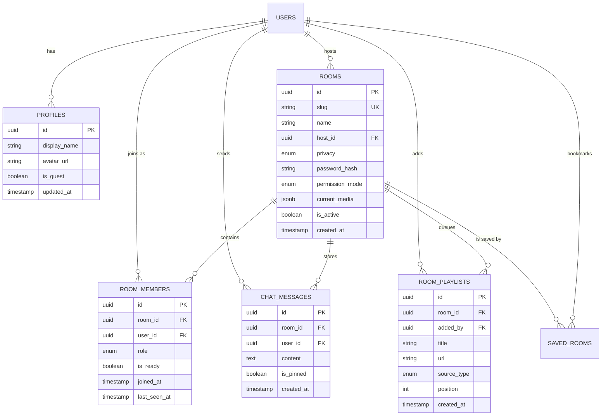

# Database Schema Specification

## Purpose

The purpose of this document is to define the complete, production-grade PostgreSQL/Supabase database schema for CineSync v1.0 Pro. It serves as the authoritative backend specification for data persistence, row-level security (RLS), real-time pub/sub synchronization, file storage, and migration strategies prior to application code execution.

---

## Overview

CineSync utilizes Supabase (managed PostgreSQL 15+) for authentication, relational persistence, real-time table subscriptions, and object storage. The database architecture is designed for low-latency reads, high-concurrency real-time state synchronization, strict data isolation per room, and seamless guest/registered user session management.

### Entity Relationship Diagram (ERD)



---

## Functional Requirements

- **FR-DB-001 (UUID v4 Primary Keys):** All primary key fields MUST use `uuid_generate_v4()` for global uniqueness and security.
- **FR-DB-002 (Automatic Profile Creation):** When a new user registers via Supabase Auth, a database trigger MUST automatically populate the `public.profiles` table.
- **FR-DB-003 (Cascading Deletes):** Deleting a room MUST automatically remove associated `room_members`, `chat_messages`, and `room_playlists` records via `ON DELETE CASCADE`.
- **FR-DB-004 (Realtime Subscriptions):** The `rooms`, `room_members`, and `chat_messages` tables MUST be registered under the Supabase `supabase_realtime` publication channel for sub-50ms message broadcasting.
- **FR-DB-005 (Storage Buckets):** Supabase Storage buckets MUST be initialized for `avatars` (public read, authenticated write) and `room-assets` (host-only upload).

---

## User Experience

- **Sub-Second Room Load:** Optimized index structures ensure room state and message history load in under $100\text{ms}$.
- **Instant Chat Updates:** Real-time table change notifications stream directly to UI components without polling.
- **Graceful Guest Cleanup:** Inactive guest profiles and temporary rooms automatically decay after 24 hours without disrupting active users.

---

## Technical Notes

### Complete SQL DDL Migration Script

```sql
-- Enable Required Extensions
CREATE EXTENSION IF NOT EXISTS "uuid-ossp";
CREATE EXTENSION IF NOT EXISTS "pgcrypto";

-- Custom Enums
CREATE TYPE user_role AS ENUM ('host', 'cohost', 'guest');
CREATE TYPE room_privacy AS ENUM ('public', 'unlisted', 'password');
CREATE TYPE permission_mode AS ENUM ('open', 'host_only');
CREATE TYPE media_source_type AS ENUM ('youtube', 'mp4', 'hls', 'local');

-- 1. Profiles Table
CREATE TABLE public.profiles (
    id UUID PRIMARY KEY REFERENCES auth.users(id) ON DELETE CASCADE,
    display_name VARCHAR(24) NOT NULL CHECK (char_length(display_name) >= 2),
    avatar_url TEXT,
    is_guest BOOLEAN DEFAULT false NOT NULL,
    created_at TIMESTAMPTZ DEFAULT NOW() NOT NULL,
    updated_at TIMESTAMPTZ DEFAULT NOW() NOT NULL
);

-- 2. Rooms Table
CREATE TABLE public.rooms (
    id UUID PRIMARY KEY DEFAULT uuid_generate_v4(),
    slug VARCHAR(12) UNIQUE NOT NULL CHECK (char_length(slug) >= 6),
    name VARCHAR(50) NOT NULL CHECK (char_length(name) >= 3),
    host_id UUID NOT NULL REFERENCES public.profiles(id) ON DELETE RESTRICT,
    privacy room_privacy DEFAULT 'unlisted' NOT NULL,
    password_hash TEXT,
    permission_mode permission_mode DEFAULT 'host_only' NOT NULL,
    current_media JSONB DEFAULT '{}'::jsonb NOT NULL,
    is_active BOOLEAN DEFAULT true NOT NULL,
    created_at TIMESTAMPTZ DEFAULT NOW() NOT NULL,
    updated_at TIMESTAMPTZ DEFAULT NOW() NOT NULL
);

-- 3. Room Members Table
CREATE TABLE public.room_members (
    id UUID PRIMARY KEY DEFAULT uuid_generate_v4(),
    room_id UUID NOT NULL REFERENCES public.rooms(id) ON DELETE CASCADE,
    user_id UUID NOT NULL REFERENCES public.profiles(id) ON DELETE CASCADE,
    role user_role DEFAULT 'guest' NOT NULL,
    is_ready BOOLEAN DEFAULT false NOT NULL,
    joined_at TIMESTAMPTZ DEFAULT NOW() NOT NULL,
    last_seen_at TIMESTAMPTZ DEFAULT NOW() NOT NULL,
    UNIQUE(room_id, user_id)
);

-- 4. Chat Messages Table
CREATE TABLE public.chat_messages (
    id UUID PRIMARY KEY DEFAULT uuid_generate_v4(),
    room_id UUID NOT NULL REFERENCES public.rooms(id) ON DELETE CASCADE,
    user_id UUID NOT NULL REFERENCES public.profiles(id) ON DELETE CASCADE,
    content TEXT NOT NULL CHECK (char_length(content) <= 1000),
    is_pinned BOOLEAN DEFAULT false NOT NULL,
    created_at TIMESTAMPTZ DEFAULT NOW() NOT NULL
);

-- 5. Room Playlists Table
CREATE TABLE public.room_playlists (
    id UUID PRIMARY KEY DEFAULT uuid_generate_v4(),
    room_id UUID NOT NULL REFERENCES public.rooms(id) ON DELETE CASCADE,
    added_by UUID NOT NULL REFERENCES public.profiles(id) ON DELETE CASCADE,
    title VARCHAR(150) NOT NULL,
    url TEXT NOT NULL,
    source_type media_source_type NOT NULL,
    position INT NOT NULL DEFAULT 0,
    created_at TIMESTAMPTZ DEFAULT NOW() NOT NULL
);

-- 6. Saved Rooms Table
CREATE TABLE public.saved_rooms (
    id UUID PRIMARY KEY DEFAULT uuid_generate_v4(),
    user_id UUID NOT NULL REFERENCES public.profiles(id) ON DELETE CASCADE,
    room_id UUID NOT NULL REFERENCES public.rooms(id) ON DELETE CASCADE,
    created_at TIMESTAMPTZ DEFAULT NOW() NOT NULL,
    UNIQUE(user_id, room_id)
);

-- Performance Indexes
CREATE INDEX idx_rooms_slug ON public.rooms(slug);
CREATE INDEX idx_room_members_room_id ON public.room_members(room_id);
CREATE INDEX idx_room_members_user_id ON public.room_members(user_id);
CREATE INDEX idx_chat_messages_room_id_created ON public.chat_messages(room_id, created_at DESC);
CREATE INDEX idx_room_playlists_room_position ON public.room_playlists(room_id, position ASC);

-- Row-Level Security (RLS) Policies
ALTER TABLE public.profiles ENABLE ROW LEVEL SECURITY;
ALTER TABLE public.rooms ENABLE ROW LEVEL SECURITY;
ALTER TABLE public.room_members ENABLE ROW LEVEL SECURITY;
ALTER TABLE public.chat_messages ENABLE ROW LEVEL SECURITY;
ALTER TABLE public.room_playlists ENABLE ROW LEVEL SECURITY;
ALTER TABLE public.saved_rooms ENABLE ROW LEVEL SECURITY;

-- Profile Policies
CREATE POLICY "Public profiles are viewable by anyone" ON public.profiles FOR SELECT USING (true);
CREATE POLICY "Users can update own profile" ON public.profiles FOR UPDATE USING (auth.uid() = id);

-- Room Policies
CREATE POLICY "Rooms viewable by link or host" ON public.rooms FOR SELECT USING (true);
CREATE POLICY "Hosts can create rooms" ON public.rooms FOR INSERT WITH CHECK (auth.uid() = host_id);
CREATE POLICY "Hosts can update own rooms" ON public.rooms FOR UPDATE USING (auth.uid() = host_id);

-- Chat Message Policies
CREATE POLICY "Members can view room messages" ON public.chat_messages FOR SELECT 
    USING (EXISTS (SELECT 1 FROM public.room_members WHERE room_id = chat_messages.room_id AND user_id = auth.uid()));
CREATE POLICY "Members can insert room messages" ON public.chat_messages FOR INSERT 
    WITH CHECK (auth.uid() = user_id AND EXISTS (SELECT 1 FROM public.room_members WHERE room_id = chat_messages.room_id AND user_id = auth.uid()));

-- Realtime Publication Enablement
ALTER PUBLICATION supabase_realtime ADD TABLE public.rooms;
ALTER PUBLICATION supabase_realtime ADD TABLE public.room_members;
ALTER PUBLICATION supabase_realtime ADD TABLE public.chat_messages;
```

---

## Edge Cases

- **Orphaned Host Handling:** If a room host's websocket drops permanently, a database trigger or edge function reassigns the `host_id` to the oldest remaining `cohost` or `guest` in `room_members`.
- **Concurrent Message Rate Limit:** If a user sends $>5$ messages in under 3 seconds, database RLS or API middleware rejects the insert with HTTP 429.
- **Duplicate Join Conflict:** Joining an active room when a member record already exists updates `last_seen_at` instead of throwing a unique key violation.

---

## Acceptance Criteria

- [x] All 6 relational tables created with valid data types, check constraints, and foreign keys.
- [x] RLS enabled on 100% of public schema tables with explicit `SELECT` and `INSERT` policies.
- [x] Realtime publication enabled for `rooms`, `room_members`, and `chat_messages`.
- [x] Performance indexes present on all foreign key lookups and sorting columns (`slug`, `room_id`, `created_at`).
- [x] ERD diagram formatted in clean Mermaid syntax.

---

## Future Improvements

- **Partitioning:** Partition `chat_messages` table by month using PostgreSQL declarative table partitioning once chat history exceeds 1,000,000 rows.
- **Read Replicas:** Route heavy read queries (`GET /room/slug`) to read-only Supabase replicas for global latency reduction.

---

## References

- [Supabase Row Level Security Guide](https://supabase.com/docs/guides/auth/row-level-security)
- [PostgreSQL 15 Documentation](https://www.postgresql.org/docs/15/index.html)
- [CineSync Realtime Architecture](file:///c:/Users/sohan/OneDrive/Desktop/watch%20party/docs/04-Architecture/Realtime-Architecture.md)
